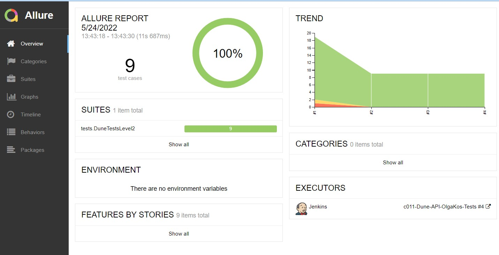
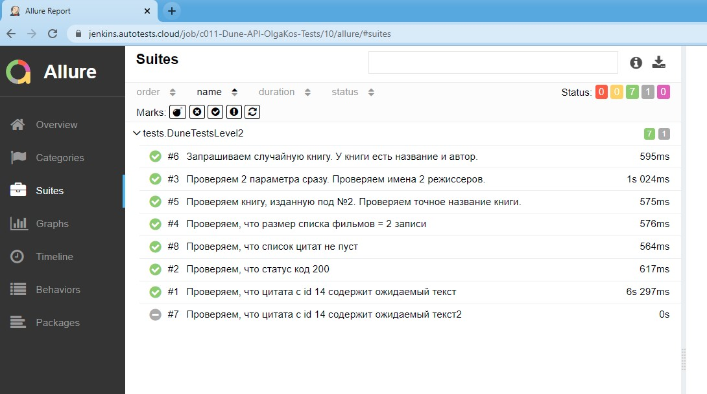
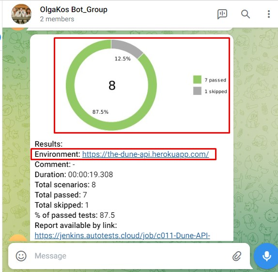

<p align="center">

</p>

# Проект по автоматизации тестирования Dune API
:earth_americas: https://github.com/ywalia01/dune-api

<p>Данный публичный API предоставляет следующий функционал: поиск цитат, запрос информации о книгах и фильмах вселенной "Дюны" :) </p>

## Содержание:
- [Технологии и инструменты](#watermelon-технологии-и-инструменты)
- [Реализованные проверки](#watermelon-Реализованные-проверки)
- [Запуск из терминала](#watermelon-Запуск-тестов-из-терминала)
- [Запуск тестов в Jenkins](#watermelon-Запуск-тестов-в-Jenkins)
- [Отчет о прохождении тестов в Allure report](#bellhop_bell-Отчет-о-прохождении-тестов-в-Allure-report)
<!--- [Тестовая документация в Allure TestOps](#watermelon-Тестовая-документация-в-Allure-TestOps)
- [Видео прохождения тестов](#watermelon-Видео-прохождения-тестов)-->
- [Отчет в Telegram](#bellhop_bell-Отчет-в-Telegram)

## :watermelon: Технологии и инструменты
<p align="center">
<a href="https://www.jetbrains.com/idea/"></a>  
<a href="https://www.java.com/"></a>
<a href="https://gradle.org/"></a>
<!-- <a href="https://selenide.org/"></a> -->
<a href="https://rest-assured.io/"></a>
<a href="https://www.jenkins.io/"></a>
<a href="https://github.com/allure-framework/allure2"></a>  
<a href="https://habr.com/ru/post/438870/"></a> 
<!--<a href="https://qameta.io/"></a>
<a href="https://aerokube.com/selenoid/"></a>-->
<a href="https://web.telegram.org/"></a>
</p>

Перечень основных технологий и инструментов, использованных при реализации этого проекта:
- Автотесты написаны на языке `Java`
- Для сборки проекта используется `Gradle`
- Проект `Lombok`- плагин компилятора, который добавляет в Java новые «ключевые слова» и превращает аннотации в Java-код.
- Java-библиотека для автоматизации тестирования REST-API: `REST Assured`
- `Jenkins` выполняет удаленный запуск тестов в визуальном-онлайн интерфейсе. Установки дополнительных приложений на компьютер пользователя не требуется.
- `Allure Report` формирует наглядный графический отчет о результатах запуска тестов.
- После завершения прогона тестов, специальный `Telegram Bot` отправляются в Telegram краткий вариант Allure Report. Отчет поступит в demo-группу `OlgaKos Bot_Group`
- <i>Артефакты тестирования (авто-скриншот и видео прогона тестов) для API проектов не предусмотрены.</i>

## :watermelon: Реализованные проверки
Примеры API тестов:
- [✓] Проверяем, что статус код 200
- [✓] Проверяем, что список цитат не пуст
- [✓] Проверяем, что цитата с id 14 содержит ожидаемый текст
- [✓] Запрашиваем случайную книгу. У книги есть название и автор.
- [✓] Проверяем книгу, изданную под №2. Проверяем точное название книги.
- [✓] Проверяем, что размер списка фильмов = 2 записи
- [✓] Проверяем 2 параметра сразу. Проверяем имена 2 режиссеров.

## :watermelon: Запуск тестов из терминала
<br>Шаги:
<br>1. Открыть терминал
<br>2. Запустить на выполнение команду:
```
gradle clean test
```

##  Запуск тестов в Jenkins
<p><a href="https://jenkins.autotests.cloud/job/c011-Dune-API-OlgaKos-Tests/">ссылка</a>
<p>Шаги:
<br>1. <i>Зарегистрированным</i> пользователем перейти на страницу сборки проекта по ссылке
<br>2. Перейти на страницу "Собрать с параметрами"
<br>3. Запустить выполнение тестов синей кнопкой "Собрать" (внизу страницы)

## :bellhop_bell: Отчет о прохождении тестов в Allure report
После того как тесты завершились, можно получить визуальный Allure отчет.

###### Главная страница Allure-отчета содержит следующие информационные блоки:
<details>
    <summary><i>Легенда</i></summary>
- `ALLURE REPORT` отображает: Дату и время прохождения теста. Общее количество пройденных кейсов. Диаграмму с указанием процента и количества успешных, упавших и сломавшихся в процессе выполнения тестов
- `TREND` - отображает тренд прохождения тестов от сборки к сборке
- `SUITES` - отображает распределение результатов тестов по тестовым наборам
- `ENVIRONMENT` - отображает тестовое окружение (стенд), на котором запускались тесты. <i>В данном примере информация не задана.</i>
- `CATEGORIES` - отображает распределение неуспешно прошедших тестов по видам дефектов
- `FEATURES BY STORIES` - отображает распределение тестов по функционалу, который они проверяют
- `EXECUTORS` - отображает исполнителя текущей сборки (ссылка на сборку в Jenkins)
</details>
 
###### Главный экран отчета (Owerwiev)
<p align="center">

</p>

###### Страница с проведенными тестами (Suites)
<p align="center">

</p>

<!--
## :watermelon: Тестовая документация в Allure TestOps

<p align="center">
  
</p>

Обзор тестовых запусков:
<p align="center">
  
</p>
-->

## :bellhop_bell: Отчет в Telegram
После завершения сборки специальный Telegram-бот отправляет сообщение с отчетом о прогоне тестов.
Чтобы видеть сообщения от бота, вступите (временно) в телеграм-группу `OlgaKos Bot_Group`

<p align="center">

</p>

----------
<br>2022-05-24 (some refactoring)
<br>2022-05-25 (add Telegram Notifications)
